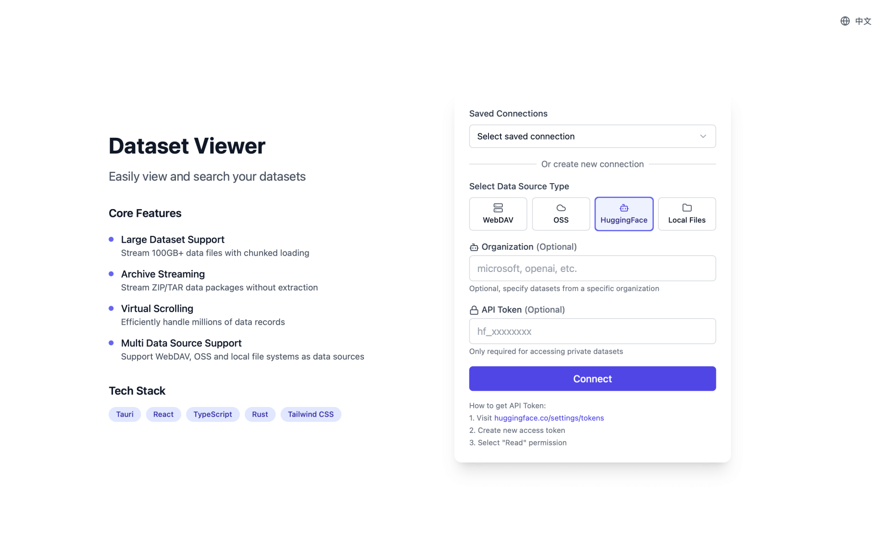

# Dataset Viewer

**⚡ Open massive files in seconds · 🔍 Millisecond search · 📦 Direct archive preview**

   

A modern, high-performance dataset viewer built with Tauri, React, and TypeScript. Designed to handle massive datasets from multiple sources with efficient streaming for large files (100GB+) and lightning-fast search capabilities.

[中文文档](README_zh.md) · [Download](https://github.com/stardustai/dataset-viewer/releases/latest) · [Report Bug](https://github.com/stardustai/dataset-viewer/issues) · [Request Feature](https://github.com/stardustai/dataset-viewer/issues)

## 🚀 Key Features

- ⚡ **Instant Large File Opening**: Handle 100GB+ files with virtualized rendering, no waiting time
- 🔍 **Millisecond Search**: Real-time search with highlighting, fast positioning in large files
- 📦 **Direct Archive Preview**: Browse ZIP/TAR files without extraction, streaming file browser
- 🗂️ **Native Multi-Format Support**: Optimized rendering for Parquet, Excel, CSV with syntax highlighting for JSON/YAML
- 🌐 **Multi-Source Data Access**: WebDAV servers, local files, cloud storage (OSS), HuggingFace datasets
- 🎨 **Modern Interface**: Dark/light themes, responsive design, multi-language support

## 📚 Supported File Types

- **📄 Text & Code**: Plain text, JSON, YAML, XML, JavaScript, Python, Java, C/C++, Rust, Go, PHP, and more

- **📝 Documents**: **Markdown** (rendered preview), **Word Documents** (.docx/.rtf, text extraction), **PowerPoint** (.pptx, slide preview), **PDF** (viewer with text search)

- **📦 Archives**: ZIP, TAR (streaming preview without extraction)

- **📊 Data Files**: **Parquet** (optimized), Excel, CSV, ODS with virtual scrolling for millions of rows

- **📱 Media**: Images, Videos, Audio (preview support)

## 📸 Screenshots

<table width="100%">
  <tr>
    <td align="center" width="50%">
      <b>Connection Setup</b> 
      
       <em>Easy connection management with multiple storage types</em>
    </td>
    <td align="center" width="50%">
      <b>File Browser</b> 
      
       <em>Modern file browser with intuitive navigation and theme support</em>
    </td>
  </tr>
  <tr>
    <td align="center" width="50%">
      <b>Text Viewer</b> 
      
       <em>Advanced text viewer with search capabilities and virtualized rendering</em>
    </td>
    <td align="center" width="50%">
      <b>Archive Viewer</b> 
      
       <em>Archive streaming with file preview and efficient content browsing</em>
    </td>
  </tr>
</table>

## ✨ Technical Highlights

- 🤖 **100% AI-Generated**: Entire codebase created through AI assistance
- 🚀 **Native Performance**: Tauri (Rust) backend + React frontend, cross-platform support
- 🧠 **Smart Memory Management**: Chunked loading, virtual scrolling, handles millions of rows effortlessly
- 📊 **Streaming Processing**: Large file chunked transmission, compressed files without full extraction

## 🎯 Perfect For

- **📊 Data Scientists**: Quickly explore large datasets, Parquet files, and CSV data
- **🔍 Log Analysis**: Search through massive log files without loading everything into memory
- **📦 Archive Management**: Browse ZIP/TAR contents without extraction
- **☁️ Remote Data**: Access files from WebDAV servers, cloud storage, and HuggingFace
- **🚀 Performance Critical**: When you need instant file access and lightning-fast search

## 🤝 Contributing

We welcome contributions! Here's how you can help:

- 🐛 **Bug Reports**: [Open an issue](https://github.com/stardustai/dataset-viewer/issues) with clear description and steps to reproduce
- 💡 **Feature Requests**: [Suggest new features](https://github.com/stardustai/dataset-viewer/issues) and explain why they would be useful
- 🔧 **Code Contributions**: Fork → Create feature branch → Make changes → Submit PR
- 📖 **Documentation**: Help improve our docs and examples
- ⭐ **Star the project**: Show your support by starring the repository

## 🙏 Acknowledgments

- **🤖 AI Development**: This project showcases the power of AI-assisted development
- **🛠 Tauri Team**: For creating an amazing framework
- **⚛️ React Community**: For the excellent ecosystem
- **🦀 Rust Community**: For the robust language and tools

## 📄 License

This project is licensed under the **MIT License** - see the [LICENSE](LICENSE) file for details.

---

**Made with ❤️ and 🤖 AI**

