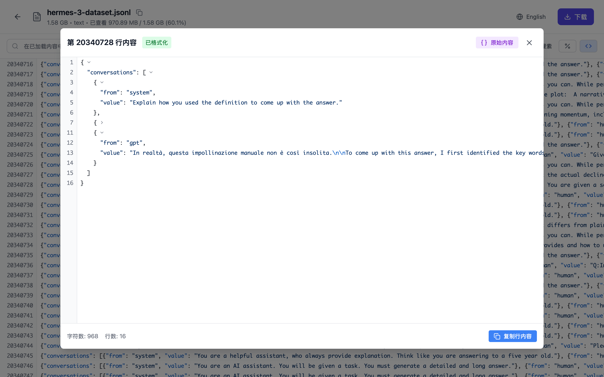
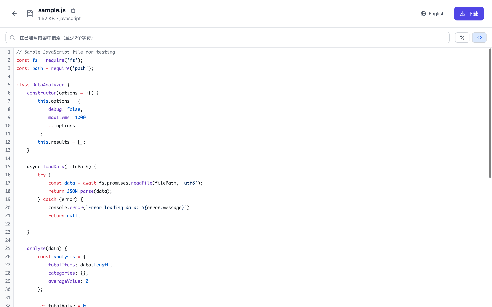
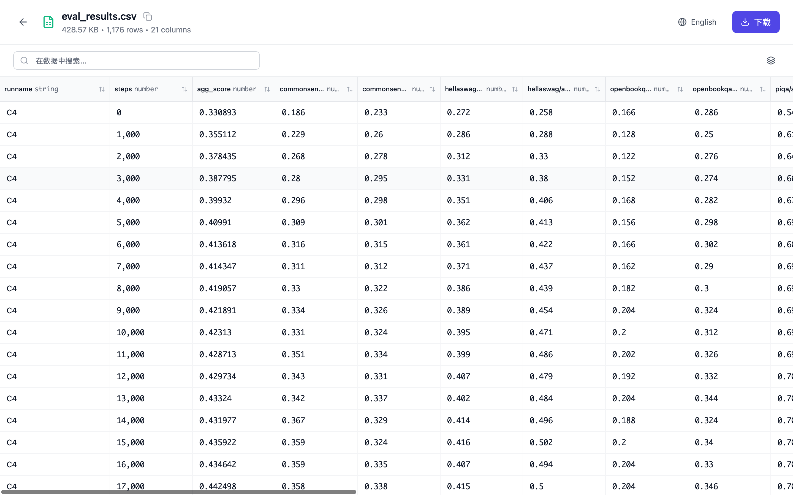

# 数据集查看器

**⚡ 秒级打开超大文件 · 🔍 毫秒级检索 · 📦 压缩包直接预览**

   

一款现代化高性能数据集查看器，基于 Tauri + React + TypeScript 构建。专为处理海量数据集而设计，支持多种数据源，可流式处理 100GB+ 大文件，具备闪电般的搜索能力。

[English](README.md) · [下载](https://github.com/stardustai/dataset-viewer/releases/latest) · [报告问题](https://github.com/stardustai/dataset-viewer/issues) · [功能建议](https://github.com/stardustai/dataset-viewer/issues)

## 🚀 核心特性

- ⚡ **超大文件秒开**：100GB+ 文件虚拟化渲染，无需等待
- 🔍 **实时搜索**：毫秒级检索，大文件快速定位和高亮显示
- 📦 **压缩包直接预览**：ZIP/TAR 文件流式浏览，无需解压
- 🌐 **多协议支持**：WebDAV、SSH/SFTP、SMB/CIFS、S3、本地文件、HuggingFace Hub
- 🗂️ **多格式支持**：Parquet、Excel、CSV、JSON、代码文件语法高亮
- 🎨 **现代化界面**：深色/浅色主题，响应式设计，多语言支持

## 📚 支持的文件类型

- **📄 文本代码**：JSON、YAML、XML、JavaScript、Python、Java、C/C++、Rust、Go、PHP 等
- **📝 文档格式**：Markdown（预览）、Word（.docx/.rtf）、PowerPoint（.pptx）、PDF（可搜索）
- ** 数据文件**：Parquet（优化）、Excel、CSV、ODS，支持虚拟滚动
- **📦 压缩包**：ZIP、TAR（流式预览，无需解压）
- **📱 媒体文件**：图片、视频、音频

## 📸 界面截图

<table width="100%">
  <tr>
    <td align="center" width="50%">
      <b>🔗 连接设置</b> 
      
       <em>简便的连接管理，支持多种存储类型</em>
    </td>
    <td align="center" width="50%">
      <b>📊 JSON查看器</b> 
      
       <em>结构化JSON显示，语法高亮，可折叠节点</em>
    </td>
  </tr>
  <tr>
    <td align="center" width="50%">
      <b>💻 代码查看器</b> 
      
       <em>多语言语法高亮，支持大文件查看</em>
    </td>
    <td align="center" width="50%">
      <b>📋 数据表格</b> 
      
       <em>CSV/Excel表格可视化，支持筛选和排序功能</em>
    </td>
  </tr>
  <tr>
    <td align="center" width="50%">
      <b>🌐 点云查看器</b> 
      
       <em>交互式3D点云数据可视化</em>
    </td>
    <td align="center" width="50%">
      <b>📦 压缩包浏览器</b> 
      
       <em>浏览ZIP/TAR压缩包，无需解压</em>
    </td>
  </tr>
</table>

## ✨ 技术亮点

- 🤖 **100% AI 生成**：完全通过 AI 辅助开发的项目
- 🚀 **原生性能**：Tauri（Rust）+ React，跨平台桌面应用
- 🧠 **智能内存**：分块加载，虚拟滚动处理百万行数据
- 📊 **流式架构**：大文件分片传输，无需完整解压

## 🎯 适用场景

- **数据科学家**：快速探索大型数据集、Parquet 文件和 CSV 数据
- **日志分析**：搜索大型日志文件，无内存限制
- **压缩包管理**：浏览压缩文件，无需解压
- **远程访问**：连接 WebDAV、SSH/SFTP、SMB、云存储、HuggingFace
- **性能关键**：即时文件访问和闪电般快速搜索

## 🔌 插件开发

通过创建自定义插件来扩展 Dataset Viewer 的功能！我们的插件系统允许你为新的文件格式添加支持。

- 📖 **[插件开发指南 (Wiki)](https://github.com/stardustai/dataset-viewer/wiki/%E6%8F%92%E4%BB%B6%E5%BC%80%E5%8F%91%E6%8C%87%E5%8D%97)** - 完整的插件开发教程
- 📦 **[@dataset-viewer/sdk](https://www.npmjs.com/package/@dataset-viewer/sdk)** - 官方插件开发 SDK
- 🎨 **[示例插件](https://github.com/stardustai/dataset-viewer/tree/main/packages)** - CAD 查看器、草图查看器等

使用我们的 SDK 快速开始，创建以下类型的插件：
- 自定义文件格式查看器
- 数据转换器和分析器
- 与外部工具集成
- 增强的可视化组件

## 🤝 贡献

我们欢迎各种形式的贡献！您可以通过以下方式帮助：

- 🐛 [报告问题](https://github.com/stardustai/dataset-viewer/issues)并提供清晰的重现步骤
- 💡 [建议功能](https://github.com/stardustai/dataset-viewer/issues)并说明其实用性
- 🔧 提交代码：Fork → 分支 → 更改 → PR
- 🔌 创建插件扩展功能
- 📖 改进文档和示例
- ⭐ 给仓库点星表示支持

## 🙏 致谢

感谢 **Tauri**、**React** 和 **Rust** 社区提供的优秀工具和框架。本项目展示了 AI 辅助开发的强大力量。

## 📄 许可证

本项目根据 **MIT 许可证** 授权 - 详见 [LICENSE](LICENSE) 文件。

---

**用 ❤️ 和 🤖 AI 制作**

