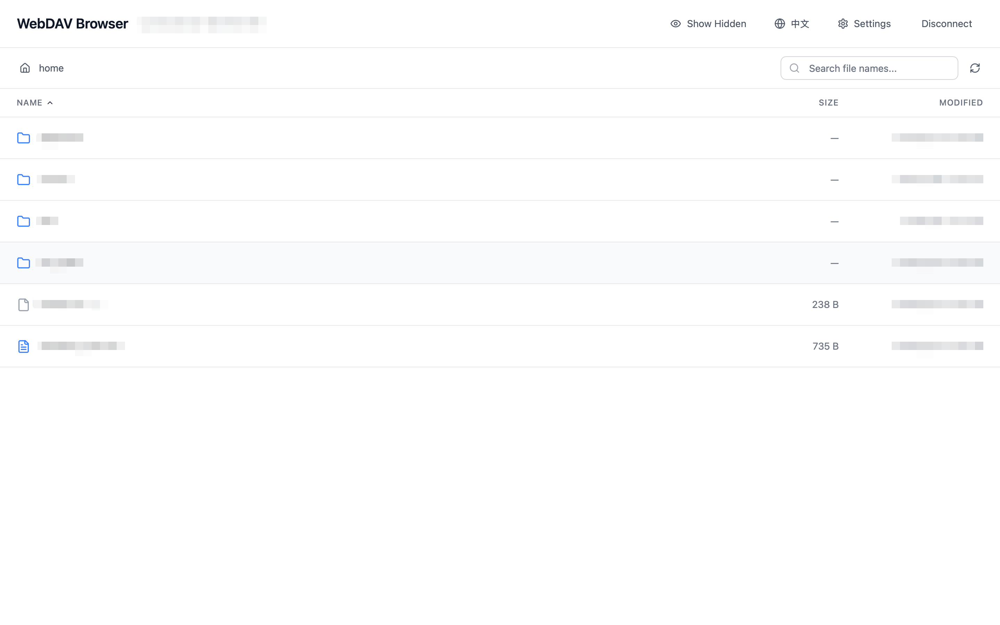

# 数据集查看器

**⚡ 秒级打开超大文件 · 🔍 毫秒级检索 · 📦 压缩包直接预览**

   

一款现代化高性能数据集查看器，基于 Tauri + React + TypeScript 构建。专为处理海量数据集而设计，支持多种数据源，可流式处理 100GB+ 大文件，具备闪电般的搜索能力。

[English](README.md) · [下载](https://github.com/stardustai/dataset-viewer/releases/latest) · [报告问题](https://github.com/stardustai/dataset-viewer/issues) · [功能建议](https://github.com/stardustai/dataset-viewer/issues)

## 🚀 核心特性

- ⚡ **超大文件秒开**：100GB+ 文件虚拟化渲染，无需等待加载
- 🔍 **毫秒级检索**：实时搜索，高亮显示，支持大文件快速定位
- 📦 **压缩包直接预览**：ZIP/TAR 文件流式浏览，无需解压即可查看内容
- 🗂️ **多格式原生支持**：Parquet、Excel、CSV 优化渲染，JSON/YAML 语法高亮
- 🌐 **多源数据接入**：WebDAV、本地文件、云存储(OSS)、HuggingFace 数据集
- 🎨 **现代化界面**：深色/浅色主题，响应式设计，多语言支持

## 📚 支持的文件类型

- **📄 文本代码**：纯文本、JSON、YAML、XML、JavaScript、Python、Java、C/C++、Rust、Go、PHP 等

- **📝 文档格式**：**Markdown**（渲染预览）、**Word 文档**（.docx/.rtf，文本提取）、**PowerPoint 演示文稿**（.pptx，幻灯片预览）、**PDF**（查看器，支持文本搜索）

- **📦 压缩包**：ZIP、TAR（流式预览，无需解压）

- **📊 数据文件**：**Parquet**（优化支持）、Excel、CSV、ODS，支持百万行虚拟滚动

- **📱 媒体文件**：图片、视频、音频（预览支持）

## 📸 界面截图

<table width="100%">
  <tr>
    <td align="center" width="50%">
      <b>连接设置</b> 
      
       <em>简便的连接管理，支持多种存储类型</em>
    </td>
    <td align="center" width="50%">
      <b>数据浏览器</b> 
      
       <em>现代化数据浏览器，具有直观导航和主题支持</em>
    </td>
  </tr>
  <tr>
    <td align="center" width="50%">
      <b>文本查看器</b> 
      
       <em>高级文本查看器，具有搜索功能和虚拟化渲染</em>
    </td>
    <td align="center" width="50%">
      <b>压缩包查看器</b> 
      
       <em>压缩包流式预览，支持文件预览和高效内容浏览</em>
    </td>
  </tr>
</table>

## ✨ 技术亮点

- 🤖 **100% AI 生成**：完全通过 AI 辅助开发的项目
- 🚀 **原生性能**：Tauri(Rust) 后端 + React 前端，跨平台支持
- 🧠 **智能内存管理**：分块加载，虚拟滚动，处理百万行数据无压力
- 📊 **流式处理**：大文件分片传输，压缩文件无需完整解压

## 🎯 适用场景

- **📊 数据科学家**：快速探索大型数据集、Parquet 文件和 CSV 数据
- **🔍 日志分析**：搜索大型日志文件，无需将所有内容加载到内存
- **📦 压缩包管理**：浏览 ZIP/TAR 内容，无需解压
- **☁️ 远程数据**：访问 WebDAV 服务器、云存储和 HuggingFace 文件
- **🚀 性能关键**：需要即时文件访问和闪电般快速搜索的场景

## 🤝 贡献

我们欢迎各种形式的贡献！您可以通过以下方式帮助我们：

- 🐛 **Bug 报告**：[提交 issue](https://github.com/stardustai/dataset-viewer/issues) 并提供清晰描述和重现步骤
- 💡 **功能建议**：[建议新功能](https://github.com/stardustai/dataset-viewer/issues) 并说明为什么有用
- 🔧 **代码贡献**：Fork → 创建功能分支 → 进行更改 → 提交 PR
- 📖 **文档改进**：帮助完善文档和示例
- ⭐ **点赞支持**：给项目点星表示支持

## 🙏 致谢

- **🤖 AI 开发**：本项目展示了 AI 辅助开发的强大力量
- **🛠 Tauri 团队**：创造了令人惊叹的框架
- **⚛️ React 社区**：优秀的生态系统
- **🦀 Rust 社区**：强大的语言和工具

## 📄 许可证

本项目根据 **MIT 许可证** 授权 - 详见 [LICENSE](LICENSE) 文件。

---

**用 ❤️ 和 🤖 AI 制作**

