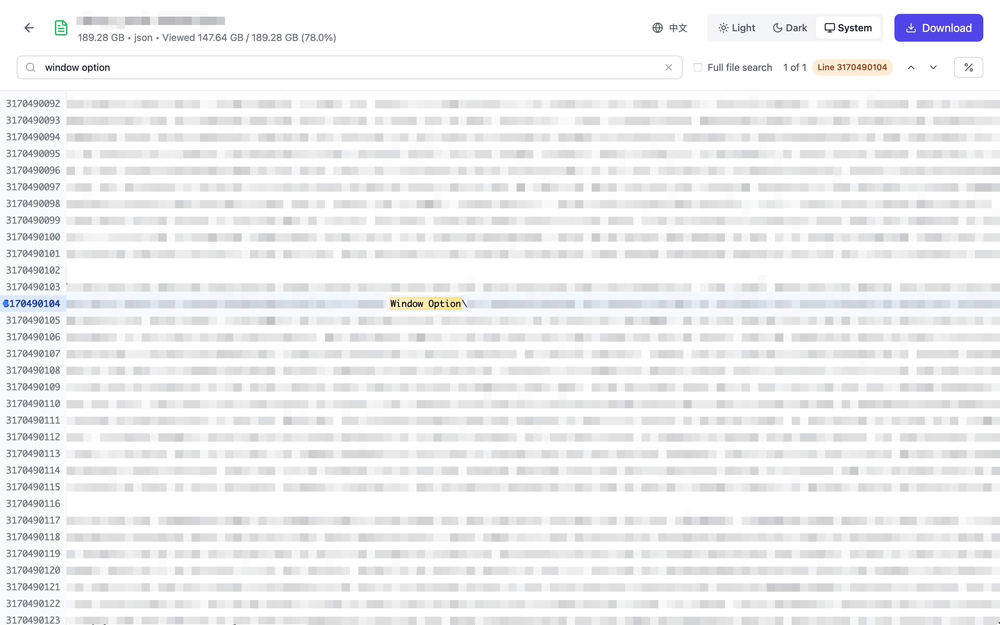

# 数据集查看器

> 🤖 **本项目 100% 由 AI 生成** 使用 GitHub Copilot 和 Claude AI

一个基于 Tauri、React 和 TypeScript 构建的现代化、高性能数据集查看工具。专为处理来自多种存储源（WebDAV、本地文件、OSS、HuggingFace）的大型数据集而设计，具有高效的流式处理和快速文件内搜索功能。

[English](README.md) · **[下载最新版本](https://github.com/stardustai/dataset-viewer/releases/latest)**

## ✨ 亮点特性

- 🤖 **100% AI 生成**：整个代码库通过 AI 辅助创建
- 🚀 **高性能**：原生 Tauri 后端配合 React 前端
- 📦 **跨平台**：单一代码库支持 Windows、macOS 和 Linux
- 🔧 **现代技术栈**：TypeScript + Tailwind CSS + Rust

## 🚀 功能特性

- 🌐 **多源支持**：WebDAV 服务器、本地文件、云存储（OSS）、HuggingFace 数据集
- 📊 **大数据集流式处理**：支持 100GB+ 文件，虚拟化渲染
- 📦 **压缩包预览**：无需解压浏览 ZIP/TAR 文件
- 🔍 **高速搜索**：实时正则表达式搜索，支持高亮
- 🎨 **现代界面**：深浅主题、响应式设计、多语言
- ⚡ **高性能**：原生 Tauri 后端配合 React 前端

## 📸 界面截图

<div align="center">
<table width="100%">
  <tr>
    <td align="center" width="50%">
      <b>连接设置</b><br>
      
      <br><em>简便的连接管理，支持多种存储类型</em>
    </td>
    <td align="center" width="50%">
      <b>数据浏览器</b><br>
      
      <br><em>现代化数据浏览器，具有直观导航和主题支持</em>
    </td>
  </tr>
  <tr>
    <td align="center" width="50%">
      <b>文本查看器</b><br>
      
      <br><em>高级文本查看器，具有搜索功能和虚拟化渲染</em>
    </td>
    <td align="center" width="50%">
      <b>压缩包查看器</b><br>
      
      <br><em>压缩包流式预览，支持文件预览和高效内容浏览</em>
    </td>
  </tr>
</table>
</div>

## 📚 支持的文件类型

### 文本文件
- 纯文本（`.txt`、`.log`）
- Markdown（`.md`、`.markdown`）
- JSON（`.json`）
- YAML（`.yaml`、`.yml`）
- XML（`.xml`）
- 配置文件（`.ini`、`.conf`、`.cfg`）

### 代码文件
- JavaScript/TypeScript（`.js`、`.ts`、`.jsx`、`.tsx`）
- Python（`.py`、`.pyx`）
- Java（`.java`）
- C/C++（`.c`、`.cpp`、`.h`、`.hpp`）
- Rust（`.rs`）
- Go（`.go`）
- PHP（`.php`）
- 以及更多...

### 压缩包文件（流式预览）
- ZIP 压缩包（`.zip`）- 无需解压即可浏览和预览内容
- TAR 压缩包（`.tar`、`.tar.gz`、`.tar.bz2`）- 流式文件浏览器

### 文档文件
- PDF（`.pdf`）- 文档查看器
- Excel（`.xlsx`、`.xls`）- 电子表格查看器

### 媒体文件（预览）
- 图像（`.jpg`、`.png`、`.gif`、`.svg`、`.webp`）
- 视频（`.mp4`、`.webm`, `.mov`）

## 🛠 开始使用

### 环境要求

- [Node.js](https://nodejs.org/)（v18 或更高版本）
- [Rust](https://rustup.rs/)（最新稳定版）
- [pnpm](https://pnpm.io/)（推荐的包管理器）

### 快速开始

1. **克隆仓库：**
```bash
git clone https://github.com/stardustai/dataset-viewer.git
cd dataset-viewer
```

2. **安装依赖：**
```bash
pnpm install
```

3. **启动开发：**
```bash
pnpm tauri dev
```

应用程序将自动在开发模式下打开。

### 📦 生产构建

```bash
# 构建和打包（推荐）
pnpm package

# 开发模式
pnpm tauri dev

# 调试构建（编译更快）
pnpm package:debug
```

**构建脚本：**
- Unix/Linux/macOS：`./build.sh` 或 `./build.sh --debug`
- Windows：`build.bat` 或 `build.bat --debug`

**输出格式：**
- **macOS**：`.dmg` 安装包、`.app` 应用包
- **Windows**：`.msi` 安装包、`.exe` 可执行文件
- **Linux**：`.deb`、`.rpm`、`.AppImage` 包

> **📱 macOS 说明**：应用未签名。如遇到安全警告，运行：`sudo xattr -d com.apple.quarantine "/Applications/Dataset Viewer.app"` 或右键点击 → "打开" → "打开"。

## 🏗 架构与性能

**技术栈：**
- **前端**：React 18 + TypeScript + Tailwind CSS
- **后端**：Tauri (Rust) + 自定义 WebDAV 客户端
- **构建**：Vite 提供快速开发和优化构建

**关键优化：**
- **📊 分块加载**：大文件以 1MB 块加载
- **📦 压缩包流式处理**：无需完整解压即可处理压缩文件
- **🖥 虚拟滚动**：百万行而不影响性能
- **🧠 智能内存管理**：高效的加载和释放
- **🔍 防抖搜索**：优化搜索防止过多 API 调用

## 💻 开发指南

**推荐 IDE**：VS Code，配合 Tauri、rust-analyzer 和 Tailwind CSS 扩展

**测试**：`pnpm test`（前端）· `cargo test`（Rust）

## 🤝 贡献

1. Fork → 创建功能分支 → 进行更改 → 提交 PR
2. **Bug 报告**：[提交 issue](https://github.com/stardustai/dataset-viewer/issues) 并提供清晰描述和重现步骤
3. **功能请求**：描述功能以及为什么有用

## 📄 许可证

本项目根据 **MIT 许可证** 授权 - 详见 [LICENSE](LICENSE) 文件。

## 🙏 致谢

- **🤖 AI 开发**：本项目展示了 AI 辅助开发的强大力量
- **🛠 Tauri 团队**：创造了令人惊叹的框架
- **⚛️ React 社区**：优秀的生态系统
- **🦀 Rust 社区**：强大的语言和工具

---

<div align="center">

**用 ❤️ 和 🤖 AI 制作**

[报告 Bug](https://github.com/stardustai/dataset-viewer/issues) · [请求功能](https://github.com/stardustai/dataset-viewer/issues) · [文档](https://github.com/stardustai/dataset-viewer/wiki)

</div>
